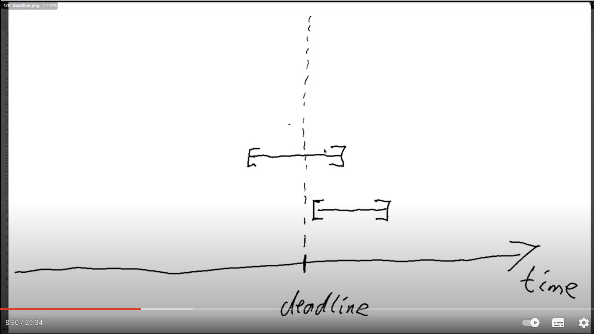
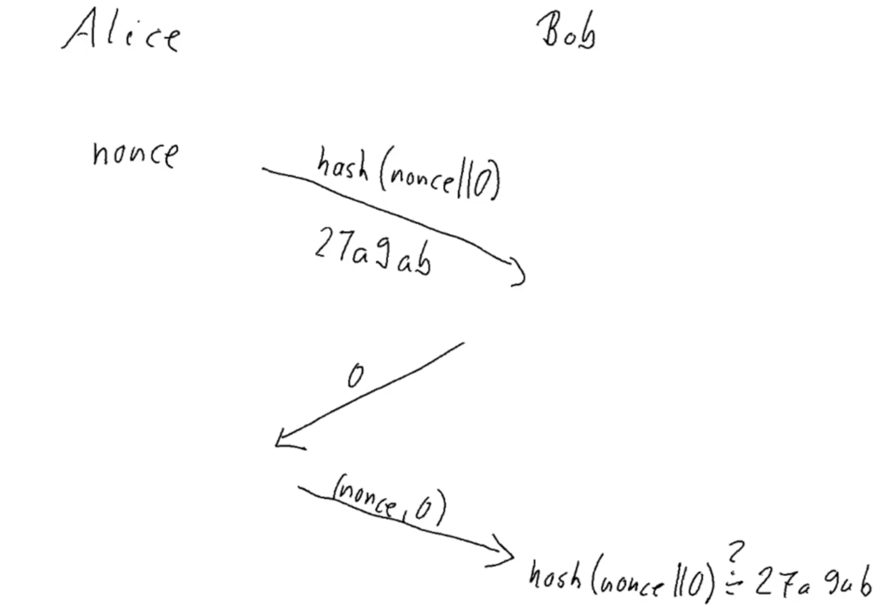
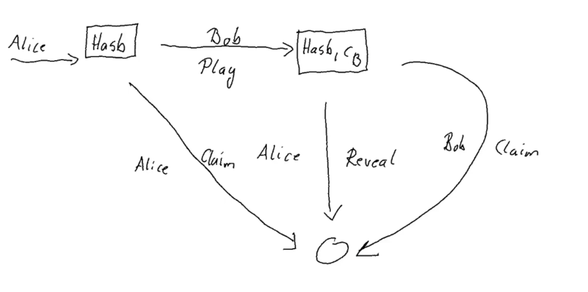

# Overview over the Plutus Pioneer Program 3rd iteration
This is a writeup about the Plutus Pioneer Program lectures. I use it to be able to quickly reread or review important or more complex topics. As ymmv about what is important or complex you might miss some things. If you want you can add them here as well by providing pull requests. 
0. YouTube video shortcuts
   1. Sometimes it's quite convenient, to speed up the playback to safe time because one can understand it at a faster pace.
   2. At the other hand - sometimes one would like to type while Lars is speaking. Then one might want to slow down the video to keep up the typing pace with Lars' speaking pace.
   3. With QWERTY keyboards it is no problem to change the playback speed.
   4. With QWERTZ keyboards it doesn't work unfortunately. In that case you need a specific plugin. E.g. the one linked below. But there are others as well.
       * Shortcut overview: `?`
       * 10 sec forward / backward = `f` / `j`
       * 5 sec forward / backward = cursor left / cursor right
       * QWERTY: faster / slower = `>` / `<`
       * QWERTZ: faster / slower doesn't work out of the box
         * Install [YouTube Playback Speed Control for Chrome](chrome-extension://hdannnflhlmdablckfkjpleikpphncik/src/option/options.html)
         * Works not only for YouTube
         * faster / slower = `+` / `-` (or setup custom key mappings
        
1. EUTxO Model
   1. [Intro](https://www.youtube.com/watch?v=X80uNXenWF4&list=PLNEK_Ejlx3x2nLM4fAck2JS6KhFQlXq2N)
   2. [EUTxO Model](https://www.youtube.com/watch?v=bfofA4MM0QE&list=PLNEK_Ejlx3x2nLM4fAck2JS6KhFQlXq2N&index=2)
   3. [Building the Example Code](https://www.youtube.com/watch?v=zPaDp4R9X7o&list=PLNEK_Ejlx3x2nLM4fAck2JS6KhFQlXq2N&index=3)
      1. [Haddock Documentation](https://youtu.be/zPaDp4R9X7o?t=351)
2. [Low Level, Untyped Validation Scripts](https://www.youtube.com/watch?v=xgnmMl-eIIM&list=PLNEK_Ejlx3x0mhPmOjPSHZPtTFpfJo3Nd&index=2)
   1. UTxO model
      1. A Tx can consume a UTxO as an input if it includes the signature of that public key address
   2. Extended UTxO
      1. Allows to have not only public key addresses but also script addresses that can run arbitrary logic
      2. When the Tx is validated, the node will run the script and check if it's valid or not.
      3. Also allows to have 
         1. Redeemers on the input side and
         2. Datum on the output side of the TX
   3. [Plutus script data type](https://youtu.be/xgnmMl-eIIM?t=307)
      1. Redeemers, Datum and Context all have the same generic low level `BuildinData` data type.
      2. It can be converted to higher level data types but it comes at a cost and some projects have choosen not to do that.
      3. The `Data` type is similar to a JSON format and can be used to convert to `BuildinData` 
      4. [`ByteString` `B` constructor and overloaded Strings with `:set -XOverloadedStrings`](https://youtu.be/xgnmMl-eIIM?t=509)
         1. Literal Strings are just lists of characters
         2. With this extension one can use literal Strings for other Stringlike types as well and one of those types is the `ByteString` type.
         3. E.g. `B "Haskell"` returns `"B Haskell" :: Data`
   4. [Writing the validator - `mkValidator`](https://youtu.be/xgnmMl-eIIM?t=600)
      1. Return type is unit. In case it's invalid an error is thrown otherwise nothing happens.
      2. A script address is more or less the hash of the validator
   5. [Writing the validator - `validator`](https://youtu.be/xgnmMl-eIIM?t=1028)
      1. Works like a makro.
      2. It converts `mkValidator` expression to an abstract syntax tree using the oxford brackets `||`
      3. Compiles it to the Plutus Core syntax (-tree) using `PlutusTx.compile`.
      4. `$$` takes the Plutus Core syntax tree and inserts (splices) it into the source code at that point as a Plutus Core expression.
      5. The `mkValidatorScript` function uses that as a parameter and turns it into an actual validator.
      6. [`{-# INLINABLE mkValidator #-}`](https://youtu.be/xgnmMl-eIIM?t=1555) pragma allows to reuse helper or library function also in the off-chain code by seperating the definitions and not inline everything.
         1. Everything that belongs to the on-chain code needs to be inlineable.
   6. [Off-chain part](https://youtu.be/xgnmMl-eIIM?t=1900)
      1. `mustPayToOtherScript` is a transaction contstraint
         1. `valHash` is the hash of the "other script"
         2. next param: empty datum
         3. last param the actual ada value
         4. `grab`
            1. If you want to consume UTxO sitting at a script address then the spending transaction needs to provide the actual validator code whereas the producing transaction only has to provide the hash.
         5. [```
            endpoints :: Contract () GiftSchema Text ()
            endpoints = awaitPromise (give' `select` grab') >> endpoints
            where
            give' = endpoint @"give" give
            grab' = endpoint @"grab" $ const grab
            ```](https://youtu.be/xgnmMl-eIIM?t=2201)
            1. `endpoints` waits for user interaction, calles the endpoint according to the user input and waits again
   7. [Test in the playground](https://youtu.be/xgnmMl-eIIM?t=2297)
   8. [Burn](https://youtu.be/xgnmMl-eIIM?t=2623)
      1. Prelude name clashes
3. [High Level Typed Validation Scripts](https://www.youtube.com/watch?v=HoB_PqeZPNc&list=PLNEK_Ejlx3x0mhPmOjPSHZPtTFpfJo3Nd&index=3)
4. [Homework](https://www.youtube.com/watch?v=_r-EpXzQGKo&list=PLNEK_Ejlx3x0mhPmOjPSHZPtTFpfJo3Nd&index=6)
   1. Homework 1
   2. [Homework 2](https://youtu.be/_r-EpXzQGKo?t=65)
5. [Script Contexts](https://www.youtube.com/watch?v=B66xLrGXwmw)
   1. Doku: haddock
   2. Purposes
      1. `Spending` the script output
      2. `Minting` a new native token
      3. `Rewarding` for staking ADA
      4. `Certifying` e.g. for delegation certificates
   3. TxInfo
      1. Describes the spending transaction
      2. `txInfoInputs`, `txInfoOutPuts` 
      3. `txInfoFee` - Transaction fee
      4. `txInfoForge` - forged (positive) or burned (negative) native tokens
      5. `txInfoDCert` - certificates e.g. for staking
      6. `tInfoWdrl` - staking withdrawals from rewards
      7. `txInfoValidRange` - the time range this transaction will be valid
      8. `txInfoSignatories` - pub keys that have signed the transaction
      9. `txInfoData` - Dict from DatumHash to Datum to include the full Datum. Spending tx'es need to include the datum of the script output whereas producing transactions that send money to a script address and have an output at that script address only have to include the hash and can optionally include the full datum.
      10. `txInfoId` - the id of this transaction
6. [Handling time - txInfoValidRange](https://www.youtube.com/watch?v=mf06ll-4j2w)
   1. Validation fails already on wallet level
   2. How can the validation of the time range be deterministic if it can succeed in the wallet but not potentially much later on-chain?
   3. We can always run the script under exactly the same conditions in the wallet already.
      1. ==>`txInfoValidRange` of type `POSIXTimeRange`
         1. The transaction is valid this the specified time range.
         2. This time range is checked on the node in the "pre-checks" before the validation script runs.
         3. The node checks the current time and checks if the time range is within `txInfoValidRange`. If it fails, then validation fails immediately without running the validator scripts.
         4. The validator script can assume that the current time does fall into this interval as the "pre-checks" would have prevented running the script otherwise.
         5. This makes validation deterministic.
            1. I guess that's the case as the validator script doesn't check against the current time anymore but always against the validity interval.
         6. It's a static piece of data attached to the transaction so the result of the validation does not depend on when it is run. 
         Weather it's run in the wallet before submission or in one of the nodes when validating the transaction.
         7. ==> The validation script is deterministic because the time rage doesn't affect it as it can be assumed to always be valid when the script is run?
         8. The trick is, to do the time check before the validation is done and then during the execution of the validator scripts we don't have to worry about it anymore and can just assume that the current time falls into this interval. Because if it wouldn't then the validation wouldn't even run in the first place because then the validation of the transaction would have failed before.
         9. While Plutus uses Posix time for the valid range, Ouroboros, the underlaying consensus protocol uses slots. This is why it is translated to slots in the final transaction.
      2. It is a type synonym for `Interval POSIXTime`
         1. http://localhost:8002/haddock/plutus-ledger-api/html/Plutus-V1-Ledger-Interval.html#t:Interval
`            Interval	 
               ivFrom :: LowerBound a	 
               ivTo :: UpperBound a`
            1. `LowerBound`:
               1. http://localhost:8002/haddock/plutus-ledger-api/html/Plutus-V1-Ledger-Interval.html#t:LowerBound
               2. `LowerBound (Extended a) Closure`
               3. See members further below
            2. `POSIXTime` is an instance of `Ord`
            3. [Members of `LowerBound`](https://youtu.be/mf06ll-4j2w?t=585)
               1. `interval` is a smart constructor of `Interval` that gives us an interval with a lower and upper bound included.
               2. `from a` = from `a` and lasts until eternety
               3. `to a` = from eternety until `a`
            4. [Playing with the intervall api](https://youtu.be/mf06ll-4j2w?t=702)
   4. When the tx gets submitted to the blockchain and validated by a node, then - before any validation scripts are run some general checks are done. E.g. 
      1. all the inputs are present 
      2. the balences add up, 
      3. the fees are included 
      4. also the time range is checked
         1. If the current time does not fall into that time range then validation fails immediately without ever running the validator scripts.
      7. By default all transaction use the infinity time range that would always be valid.
   5. The consensus protocol Ouroboros uses slots instead of posix time ==> Slot is the native measure of time in Cardano. But Plutus uses realtime.
   6. To convert between realtime and slot numbers.
   7. If the slot length would change the conversion could be wrong. To be on the safe side - don't use a longer time horizon than 36 hours in the future (or infinity). Because if the protocol parameters would change one would know it at least 36 hours in advance.
   8. [POSIXTimeRange](https://youtu.be/mf06ll-4j2w?t=525)
      1. [Repl examples](https://youtu.be/mf06ll-4j2w?t=705)
7. [Vesting Example](https://www.youtube.com/watch?v=ae7U_yKIQ0Y)
   1. The deadline will be within the valid time interval when the validation script runs. But that time might still be before the deadline: 
   2. The whole interval must be after the deadline.
      1. The interval from the deadline until infinity must contain the transaction interval
         1. This way the current time will be after the deadline.
   3. [`grab`](https://youtu.be/ae7U_yKIQ0Y?t=871)
      1. query all UTxOs where the wallet is the beneficiary and where the deadline has been reached.
      2. Create a transaction that collect all of them in the same transaction
      3. In reality the transaction can only be of a limited size so not many UTxOs could be used at the same time in reality.
      4. `Constraints.mustValidateIn (from now)`
   4. [Simulation](https://youtu.be/ae7U_yKIQ0Y?t=1173)
      1. Wallet 1 gives ADA to script for wallet 2 at slot 10
      2. Wallet 1 gives ADA to script for wallet 2 at slot 20
      3. Wallet 1 gives ADA to script for wallet 3 at slot 10
      4. Wait for 11 / 21 slots
      5. Wallet 2 grabs
      6. Wallet 3 grabs
      7. Wait for 5 slots 
      8. [Retrieve the data to input in the repl](https://youtu.be/ae7U_yKIQ0Y?t=1319)
         1. Get the `getPubKeyHash`
            1. `import Wallet.Emulator`
            2. `:i Wallet` wraps a walletId
            3. For real wallets but also for mock wallets that are used in the playground
            4. `:i WalletId`
            5. `knownWallet 2` returns a `Wallet` instance of wallet 2
            6. `mockWalletPaymentPubKeyHash` returns the PaymentPubKeyHash of a mock wallet and takes a wallet as a parameter.
               1. `mockWalletPaymentPubKeyHash $ knownWallet 2`
         2. Convert slots to PosixTime
            1. `import Ledger.Time`
            2. `import Ledger.TimeSlot`
            3. `import Data.Default`
            4. `slotToBeginPOSIXTime def 10`
8. <a id="parameterized">[Parameterized Contracts](https://www.youtube.com/watch?v=XqFILXV_ACM)</a>
   1. The validator script will get a parameter compiled into it
   3. For more about the `.` operator see [function composition below](#functioncomposition)
   2. Can only be used for datalike types but cannot contain functions
9. [Deploy to the testnet](https://www.youtube.com/watch?v=ABtffZPoUqU)
   1. If a transaction fails it normally fails already when submitting it to the blockchain. But one could insist to send it anyways and if it actually fails someone needs to handle the transaction costs. For that case a colleteral is needed.
   2. [Using Plutus in the Cardano CLI](https://youtu.be/ABtffZPoUqU?t=977)
      1. It uses the Cardano API - the Haskell lib that the Cardano CLI uses under the hood to
         1. talk to the node
         2. submit transactions
         3. query the blockchain
         4. Has its own data type that is very similar to the Plutus data types
         5. `dataToScriptData :: Data -> ScriptData`
            1. converts from Plutus `Data` to `ScriptData` of the Cardano API
         6. [`writeJSON()`](https://youtu.be/ABtffZPoUqU?t=1033)
         7. ...
         8. [Generate script address via the CLI](https://youtu.be/ABtffZPoUqU?t=1241)
10. [Homework](https://www.youtube.com/watch?v=GGUT2O_0urQ&list=PLNEK_Ejlx3x2zxcfoVGARFExzOHwXFCCL&index=7)
    1. First part
    2. [Second part](https://youtu.be/GGUT2O_0urQ?t=367)
11. [Monads](https://www.youtube.com/watch?v=f2w-MB3X4a0&list=PLNEK_Ejlx3x230-g-U02issX5BiWAgmSi&index=2)
    1. Executing a Monad like `foo :: IO Int` just builds the same recipe every time and still doesn't have any sideeffects.
       1. `IO` is a type constructor that takes one argument like `Maybe` or Generics like `Optional<Integer>` in Java.
    2. Can only  be execute in the main entry point similar to the `main` method in Java and in the repl.
    3. [Combining IO actions](https://youtu.be/f2w-MB3X4a0?t=745)
       1. [`toUpper :: Char -> Char` | `map :: (a -> b) -> [a] -> [b]`](https://youtu.be/f2w-MB3X4a0?t=877)
       2. `map toUpper "Haskell"` passes the two parameters to `map`, executes the `toUpper` function for every char element of the `"Haskell"` array and returns the result.
       3. [Functor](https://youtu.be/f2w-MB3X4a0?t=811)
          1. [`fmap :: Functor f => (a -> b) -> f a -> f b`](https://youtu.be/f2w-MB3X4a0?t=942)
          2. `:t fmap (map toUpper) getLine`: `fmap (map toUpper) getLine :: IO [Char]`
          3. `fmap (map toUpper) getLine` providing "Haskell" returns "HASKELL"
          4. The difference to `map` is, that the second parameter can be a function that provides a parameter.
          5. `fmap` can map existing IO actions and turn them into other IO actions. 
       4. [Sequence operator >>](https://youtu.be/f2w-MB3X4a0?t=1006)
          1. `:t putStrLn`: `putStrLn :: String -> IO ()`
             1. Expects a String and outputs it.
             2. Is an IO action with a unit result.
          2. `>>` chains two IO actions together ignoring the result of the first
          3. Executes both actions in sequence
       5. [Bind operator >>=](https://youtu.be/f2w-MB3X4a0?t=1076)
          1. See also: http://learnyouahaskell.com/a-fistful-of-monads 
          2. `:t (>>=)`: `(>>=) :: Monad m => m a -> (a -> m b) -> m b`
          3. `m a` IO action that returns an `a`
          4. `(a -> m b)` a function that - given an `a` - returns an IO action that returns `b`
          5. `-> m b` will be combined to an IO action that produces a `b`
          6. [Example `getLine >>= putStrLn`](https://youtu.be/f2w-MB3X4a0?t=1115)
             1. without infix: `(>>=) getLine putStrLn` 
             2. `:t getLine`: `getLine :: IO String`
             3. `:t putStrLn`: `putStrLn :: String -> IO ()`
             4. Returns an IO action that produces a String
             5. `IO String (String -> IO()) -> IO ()`
          7. [`return`](https://youtu.be/f2w-MB3X4a0?t=1197)
             1. `return :: Monad m => a -> m a`
             2. Will not perform any sideeffects and immediately return the given `a`
             3. Wraps a pure value into a typed function.
          8. [Example](https://youtu.be/f2w-MB3X4a0?t=1259)
             ```
             main :: IO ()
             main = bar
             
             bar :: IO ()
             bar = getLine >>= \s ->
                   getLine >>= \t ->
                   putStrLn (s ++ '-' ++ t)
             ```
          9. asdf
    4. [`Maybe`](https://youtu.be/f2w-MB3X4a0?t=1424)
    5. [`Either`](https://youtu.be/f2w-MB3X4a0?t=2085)
    6. [`Writer`](https://youtu.be/f2w-MB3X4a0?t=2567)
    7. [`Tell`](https://youtu.be/f2w-MB3X4a0?t=2805)
    8. [Monad summary](https://youtu.be/f2w-MB3X4a0?t=3247)
       1. The possibility to bind two computations together
       2. The possibility to construct a computation from a pure value without making use of any of the potential side-effects.
    9. [`Applicative`](https://youtu.be/f2w-MB3X4a0?t=3630)
       1. `pure`
       2. `<*>` called "ap" operator
       3. Superclass is `Functor`
          1. Has `fmap` function
    10. [Use bind for all kinds of Monads](https://youtu.be/f2w-MB3X4a0?t=3940)
        1. `threeInts` for `Maybe`, `Either`, (`Writer`),...
        ```haskell
        threeInts :: Monad m => m Int -> m Int -> m Int -> m Int
        threeInts mx my mz =
        mx >>= \k ->
        my >>= \l ->
        mz >>= \m ->
        let s = k + l + m in return s
        
        foo'' :: String -> String -> String -> Maybe Int
        foo'' x y z = threeInts (readMaybe x) (readMaybe y) (readMaybe z)
        
        foo'' :: String -> String -> String -> Either String Int
        foo'' x y z = threeInts (readEither x) (readEither y) (readEither z)
        ```
    11. [Monad summary based on `threeInts`](https://youtu.be/f2w-MB3X4a0?t=4384)
        1. Computation with a super power (side-effect, fail with an error msg, log messages,...)
        2. Kind of an "Overloaded semicolon" ;-)
    12. <a id="donotation">[`do` notation](https://youtu.be/f2w-MB3X4a0?t=4615)
        ```haskell
        threeInts' :: Monad m => m Int -> m Int -> m Int -> m Int
        threeInts' mx my mz = do
        k <- mx
        l <- my
        m <- mz
        let s = k + l + m
        return s
        ```
12. [`Contract` Monad](https://www.youtube.com/watch?v=yKX5Ce8Y0VQ&list=PLNEK_Ejlx3x230-g-U02issX5BiWAgmSi&index=4)
    1. `Contract w s e a`
       1. `w`
          1. Allows the contract to write log messages of type `w`
          2. Is an event to the outside world.
       2. `s` Specifies the endpoints that are available to the contract
       3. `e` Type of error messages. E.g. `Text`
       4. `a` return type
    2. Example contract
       1. [`String`/`Text` handling](https://youtu.be/yKX5Ce8Y0VQ?t=174)
          1. `OverloadedStrings`, `TypeApplications` to disambiguate literal `String`s
          2. `@String "hello from the contract"`
       2. `()` = Unit = a value
       3. `Void` has no value
       4. [`Contract.handleError()`](https://youtu.be/yKX5Ce8Y0VQ?t=616)
          1. `unpack` converts `Data.Text` to `String`
    3. [The schema parameter](https://youtu.be/yKX5Ce8Y0VQ?t=979)
       1. [Type synonym](https://youtu.be/yKX5Ce8Y0VQ?t=1026)
          1. `type MySchema = Endpoint "foo" Int .\/ Endpoint "bar" String`
             1. That's an advanced Haskell feature where even `"foo"` is a type.
                1. Made possible by the `DataKinds` extension
             2. It's an endpoint "foo" of type `Int`
    4. `endpoint`
    5. [`callEndpoint`](https://youtu.be/yKX5Ce8Y0VQ?t=1309)
    6. [`w` observable state parameter](https://youtu.be/yKX5Ce8Y0VQ?t=1601)
       1. `Monoid`, `mempty`, `mappend`
       2. `tell` `mappend`s to the existing state
       3. One can communicate to the contract by invoking the endpoint and it can communicate back to the emulator trace or the browser / user interface of the dapp by calling `tell`
13. [Homework](https://www.youtube.com/watch?v=sxRLzR0jdiY&list=PLNEK_Ejlx3x230-g-U02issX5BiWAgmSi&index=5)
14. Native Tokens
    1. [What means "value" in Cardano](https://www.youtube.com/watch?v=mGPqi9m0EPw&list=PLNEK_Ejlx3x0G8V8CDBnRDZ86POVsrfzw&index=2)
       1. Each UTxO has an address and a `Value`.
          1. (... and `Datum` and `Redeemer`)
    2. ["Values"](https://www.youtube.com/watch?v=4iNTgjovMRg&list=PLNEK_Ejlx3x0G8V8CDBnRDZ86POVsrfzw&index=2)
       1. [`Value` constructor](https://playground.plutus.iohkdev.io/doc/haddock/plutus-ledger-api/html/Plutus-V1-Ledger-Value.html#t:Value)
          1. `getValue :: Map CurrencySymbol (Map TokenName Integer)`
             1. A map of `CurrencySymbol` to a map of `TokenName` to `Integer`
             2. [`CurrencySymbol` constructor](https://playground.plutus.iohkdev.io/doc/haddock/plutus-ledger-api/html/Plutus-V1-Ledger-Value.html#t:CurrencySymbol)
                1. `unCurrencySymbol :: BuiltinByteString`
                   1. [NewType](https://wiki.haskell.org/Newtype) wrapper around a `BuiltinByteString`
                2. [It is actually the hash of a script - the minting policy](https://youtu.be/4iNTgjovMRg?t=642)
                   1. It is needed for transactions who want to mint / create or burn native tokens
             3. [`TokenName` constructor](https://playground.plutus.iohkdev.io/doc/haddock/plutus-ledger-api/html/Plutus-V1-Ledger-Value.html#g:2)
                1. `unTokenName :: BuiltinByteString`
                2. [NewType](https://wiki.haskell.org/Newtype) wrapper around a `BuiltinByteString`
          2. Means: How many units of each asset class are contained in the UTxO
    3. [`AssetClass` is the combination of `CurrencySymbol` and `TokenName`](https://playground.plutus.iohkdev.io/doc/haddock/plutus-ledger-api/html/Plutus-V1-Ledger-Value.html#g:3)
       1. ADA is an asset class and custom native tokes are other asset classes
       2. `unAssetClass :: (CurrencySymbol, TokenName)`
          1. Equivalent to `Map CurrencySymbol (Map TokenName Integer)`
    4. Playing in the repl
       1. ```haskell
          import Plutus.V1.Ledger.Value
          import Plutus.V1.Ledger.Ada
          :set -XOverloadedStrings -- to enter ByteStrings as literal strings
          ```
          `CurrencySymbol` and `TokenName` implement the `isString` class. This means we can enter both of them as literal Strings as well. 
       2. `adaSymbol` returns an empty ByteString as the `CurrencySymbol` of ADA
       3. `adaToken` returns an emtpy ByteString as the `TokenName` of ADA
       4. `lovelaceValueOf` given an Integer returns a `Value` of ADA
          1. `lovelaceValueOf 1234`  
          2. `Value (Map [(,Map [("",1324)])])`
             1. a map of an empty ByteString to a map of an empty ByteString to 1234
          3. [Combine / add up with a `mappend` of Monoid (https://youtu.be/4iNTgjovMRg?t=301)
          4. `<>` the `mappend` operator from the superclass of `Monoid`
             1. `lovelaceValueOf 10 <> lovelaceValueOf 20`
             2. `Value (Map [(,Map [("",30)])])`
       5. [Create values containing native tokens](https://youtu.be/4iNTgjovMRg?t=366)
          1. `:t singleton`: `singleton :: CurrencySymbol -> TokenName -> Integer -> Value`
          2. Specifies the amount of an asset class that is there.
          3. `singleton "a8ff" "ABG" 7`: `Value (Map [(a8ff,Map [("ABG",7)])])`
          4. `singleton "a8ff" "ABG" 7 <> lovelaceValueOf 42 <> singleton "a8ff" "XYZ" 100`
             1. ```haskell
                Value (Map [
                   (,Map [("",42)])
                   (a8ff, Map [
                         ("ABG",7),
                         ("XYZ",100)
                   ])
                ])
                ```
          5. [`valueOf` given a `Value` extract the amount of a given asset class](https://youtu.be/4iNTgjovMRg?t=551)
             1. `:t valueOf`: `valueOf :: Value -> CurrencySymbol -> TokenName -> Integer`
             2. `valueOf v "a8ff" "XYZ"`: 100
             3. `valueOf v "a8ff" "ABG"`: 7
             4. `valueOf v "a8ff" ""`: 42
          6. `:t flattenValue`: `flattenValue :: Value -> [(CurrencySymbol, TokenName, Integer)]`
             1. Flattens the map into a list of triples
             2. `flattenValue v`: `[(,"",42),(a8ff,"XYZ",100),(a8ff,"ABG",7)]`
       6. [Minting Policy](https://www.youtube.com/watch?v=DBUdFsZpW7A&list=PLNEK_Ejlx3x0G8V8CDBnRDZ86POVsrfzw&index=3)
          1. [`ScriptContext` Haddock](http://localhost:8002/haddock/plutus-ledger-api/html/Plutus-V1-Ledger-Api.html#t:ScriptContext) 
          2. `ScriptContext` ==> `scriptContextPurpose` had `Spending` until now.
          3. `ScriptContext` ==> `scriptContextTxInfo` has all the context info about the tx that is being validated
          4. Minting / monetary policies is/are triggered when `TxInfo`==> `txInfoMint` contains a non-zero `Value`
          5. For each `CurrencySymbol` the corresponding script is executed
             1. The minting policy scripts have only two inputs. The `Redeemer` and the `ScriptContext` (no Datum).
             2. The `Redeemer` is provided by the transaction for all the scripts inputs
             3. `ScriptContext` ==> `scriptContextPurpose` ==> `Minting` will be the `CurrencySymbol` whose minting/burning currently being checked.
             4. All the policies need to pass. If one of them fails the whole transaction will fail.
          6. [Example: Free minting (Free.hs)](https://youtu.be/DBUdFsZpW7A?t=289)
          7. [Example: Signed minting (Signed.hs)](https://www.youtube.com/watch?v=4SROikF8JwE&list=PLNEK_Ejlx3x0G8V8CDBnRDZ86POVsrfzw&index=5)
             1. See also [parameterized validators](#parameterized).
             2. <a id="functioncomposition">Function composition with the dot (`.`) infix operator</a>
                1. http://learnyouahaskell.com/higher-order-functions
                2. Composing two functions produces a new function
                3. Uses currying?
                4. Definition:
                   1. ```haskell
                         (.) :: (b -> c) -> (a -> b) -> a -> c
                         f . g = \x -> f (g x)
                      ```
                   2. ```haskell
                         let x = negate . (* 3)
                         x 2
                         ==> -6
                      ```
                   3. Returns a function (`x`) that can have parameters (`2` in the example) 
                   4. `x` first applies the parameter to the second function (`(g x)`) and then runs the first function on the result (`f (g x)`)
                   5. One of the uses for function composition is making functions on the fly to pass to other functions. Sure, can use lambdas for that, but many times, function composition is clearer and more concise.
                   6. Equivalent: `(\x -> negate ((* 3) x))`
                   7. Examples:
                      1. ```haskell
                             let x = negate . abs
                             x (-2)
                             ==> -2
                             ```
                      2. `map (negate . abs) [5,-3,-6,7,-3,2,-19,24]`
                         1. `[-5,-3,-6,-7,-3,-2,-19,-24]`
                         2. It's equivalent to `map (\x -> negate (abs x))`
             3. `scriptCurrencySymbol policy` calls `scriptCurrencySymbol` with `policy` as a parameter.
             4. `scriptCurrencySymbol . policy` returns a function that can have parameters.
                1. When the function is called, then first `policy` will be called with the parameters and then `scriptCurrencySymbol` will be called on the result.
             5. `:t txSignedBy`: `txSignedBy :: TxInfo -> PubKeyHash -> Bool`
             6. `:t scriptContextTxInfo`: `scriptContextTxInfo :: ScriptContext -> TxInfo`
                1. See: http://localhost:8002/haddock/plutus-ledger-api/html/Plutus-V1-Ledger-Api.html#t:ScriptContext
             7. `mkPolicy pkh () ctx = txSignedBy (scriptContextTxInfo ctx) $ unPaymentPubKeyHash pkh`
                1. Checks wether the tx that is minting the native token has been signed by the given PubKeyHash ()
             8. ==>! The minting policy script is now parameterized with the `PaymentPubKeyHash`.
                1. This hash is different for every wallet. ==> Thus it produces a different policy script hash. ==> Thus is results in a different `CurrencySymbol`.
                2. In the emulator trace example the token name `ABC` is the same but the generated `CurrencySymbol` is different. Resulting in a different asset class.
                3. ==> Even though the token name is the same, the asset class will still depend on the wallet minting it.
          8. [NFTs (NFT.hs) / max token amount](https://www.youtube.com/watch?v=2lKN0ZL_EQU&list=PLNEK_Ejlx3x0G8V8CDBnRDZ86POVsrfzw&index=5)
             1. Solution 1 (Mary era): create a monetary policy script with a `PaymentPubKeyHash` that doesn't allow to mint more of it after a certain deadline.
                1. This way: Before the deadline no one else can mint more as it's only allowed to be done with the `PaymentPubKeyHash` of the wallet.
                2. After the deadline it's not allowed to add more as the policy script will deny it.
             2. Solution 2 (Plutus): 
                1. The UTxO is unique as it's the nth index output of a transaction which itself is unique and as an own id.
                   1. A transaction is only unique because of fees.
                   2. A transaction that doesn't have inputs and only outputs without value might not be unique.
                   3. But as one always need to pay fees for transactions that is not possible. One always need to have an input to be consumed to cover the transaction fees.
                   4. Such an input always needs to come from an output of another transaction.
                   5. The inputs are used to create the transaction hash. As they are unique the transaction hash is unique.
                   6. This is recursive.
                2. Check in the minting policy that the transaction consumes a specific UTxO. This way the minting policy can only be called once.
                3. Additionally check that the `txInfoMint` has a value with an amount of only 1.
                4. [Parameterized policy function with two parameters](https://youtu.be/2lKN0ZL_EQU?t=830)
                5. [Offchain contract that mints the NFT](https://youtu.be/2lKN0ZL_EQU?t=892)
15. Lecture 6: End to end PAB and minting native tokens
    1. [Mint via CLI](https://www.youtube.com/watch?v=kfvzrC9J02k&list=PLNEK_Ejlx3x2sBWXHdFBRgkzPF6N-1LVi&index=3)
    2. Unwraps the minting policy to get the script in `src/Week06/Utils.hs` `writeMintingPolicy()`
    3. The policy looks like that `mkTokenPolicy :: TxOutRef -> TokenName -> Integer -> () -> ScriptContext -> Bool`
       1. It needs the UTxO, the token name and the amount to be compiled into the script
    4. Will be used to write the policy to a file by this app `app/token-policy.hs`
    5. A TxOutRef consists of the transaction id of the transaction which created it and the index of the output of that transaction.
       1. The order of outputs of a transaction matters. The order of input doesn't.
       2. e.g. the TxOutRef here is `0c60c01eef31f00bd7f8dffbdc59e141d5db7a523105734cee37a700d5354e56#0`
       ```
                                         TxHash                    TxIx
       -------------------------------------------------------------------------
       0c60c01eef31f00bd7f8dffbdc59e141d5db7a523105734cee37a700d5354e56     0
       ```
       3. Whenever we see that some type has an `isString` instance then we could use a String literal in combination with the `OverloadedStrings` extension to construct a value of this type.
       4. Or programmatically we can use the `fromString()` function to turn a String into this type.
    6. `AssetName` is the Cardano API type that corresponds to the Plutus token name type.
    7. Example result: 
       1. https://testnet.adatools.io/tokens/asset1yza3cuv5thlfr9as06avqgggwv4sch9e0lheq3
       2. `Asset ID` = policy id + hash of the token name
       3. policy id is equivalent to the currency symbol
       4. https://explorer.cardano-testnet.iohkdev.io/de/transaction?id=702b250c69a924f9baffab93c44c0c128013fcdd7a11b2679561356621370b75
    8. [PAB Deployment Scenarios](https://www.youtube.com/watch?v=tW7uoY16gC0&list=PLNEK_Ejlx3x2sBWXHdFBRgkzPF6N-1LVi&index=4)
       1. See
          1. http://localhost:8002/plutus/explanations/pab.html
       2. PAB
          1. Needs the offchain code written in the contract monad that the PAB can execute. 
       3. Wallet Backend
          1. E.g. used by the Daedalus wallet
          2. Can administer multiple wallets
             1. hd wallets
                1. infinity of potential addresses
                2. The public keys get derived with each (step?) so one usually never uses the same one again
                3. 
       4. [Chain index](https://youtu.be/tW7uoY16gC0?t=67)
          1. The SQL database that stores the blockchain data of the node
          2. Something like a lightweight version of dbsync
          3. Allows to lookup the datum belonging to a given datum hash
          4. Needed by the PAB
       5. Deployment scenarios
          1. WBE / Hosted by the dapp provider (currently suppored)
              1. The PAB has full control over one or more of the wallets.
              2. Also over their spending passwords.
              3. It can sign transactions with the with the wallets.
              4. The user could host that by himself but then it would rather be a bundle of apps that would run on the users machine.
                  1. Consume quite a lot of resources (memory, cpu, harddisk space,...)
              5. Not the decentralized way it should be.
          2. Browser wallet (currently not supported)
             1. Serverside
                1. PAB
                   1. Creates transaction without being able to sign them because it doesn't have access to a wallet.
                   2. It exposes this unsigned transaction
                   3. The browser picks it up and signs it using a browser wallet
                   4. Currently only exposes unbalanced transactions
                      1. The browser would have to balance it and that is very tricky
                2. Chainindex
                3. Node
                4. Not the wallet
    9. [The contracts](https://www.youtube.com/watch?v=JgNhY_uuuGA&list=PLNEK_Ejlx3x2sBWXHdFBRgkzPF6N-1LVi&index=5)
       1. Utility functions for the off-chain part
          1. The Plutus address
             1. http://localhost:8002/haddock/plutus-ledger/html/Ledger.html#t:Address
             2. ```haskell
                data Address
                Constructors
                Address	 
                   addressCredential :: Credential	 
                   addressStakingCredential :: Maybe StakingCredential
                ```
             3. ```haskell
                data Credential
                Constructors
                   PubKeyCredential PubKeyHash
                   ScriptCredential ValidatorHash
                ```
       2. [`Token.OffChain` for `mintToken :: TokenParams -> Contract w s Text CurrencySymbol`](https://youtu.be/JgNhY_uuuGA?t=201)
          1. [`TokenParams` type](https://youtu.be/JgNhY_uuuGA?t=213)
             1. `tpAddress` - the address of a wallet that receives the tokens
          2. The change-address is picked by the wallet
          3. [The `mintToken` function](https://youtu.be/JgNhY_uuuGA?t=281)
             1. The returned `CurrencySymbol` is not needed. It's a leftover from trying to implement the Oracle example.
             2. [`o    <- fromJust <$> Contract.txOutFromRef oref`](https://youtu.be/JgNhY_uuuGA?t=379)
                1. `<$>` is `fmap` as an infix operator
             3. [For the case where `addressStakingCredential` is present there is a separate `Constraints` function to be used:](https://youtu.be/JgNhY_uuuGA?t=505)
                1. `Constraints.mustPayToPubKeyAddress x y val`
             4. [`Constraints.mustSpendPubKeyOutput oref` to make sure that there is exactly one minting tx for this currency symbol.](https://youtu.be/JgNhY_uuuGA?t=636)
                1. This `oref` will be "compiled" into the minting policy. This way the minting policy will be successfully validated only with this `oref`.
                2. As this `oref` will be spent with that transaction the minting policy can only be successfully run once.
             5. [Submitting the tx with `adjustAndSubmitWith`](https://youtu.be/JgNhY_uuuGA?t=659)
                1. `unbalanced <- adjustUnbalancedTx <$> mkTxConstraints lookups constraints`
                   1. Adds the min-ADA to all the outputs as the minting transactions wouldn't have any ADA otherwise but need them.
       3. [`Trace` emulator trace](https://youtu.be/JgNhY_uuuGA?t=838)
       4. `Monitor` contract
          1. [Why an additional contract?](https://youtu.be/JgNhY_uuuGA?t=935)
          2. [The idea of the contract](https://youtu.be/JgNhY_uuuGA?t=1003)
             1. Queries the blockchain and reports a value sitting on that address constantly
       5. [Minting with the PAB](https://www.youtube.com/watch?v=X6AyZIZ0vaE&list=PLNEK_Ejlx3x2sBWXHdFBRgkzPF6N-1LVi&index=6)
          1. ```haskell
             data TokenContracts = Mint Token.TokenParams | Monitor Address
             deriving (Eq, Ord, Show, Generic, FromJSON, ToJSON, ToSchema)
             ```
             1. Defines which contracts the PAB will expose
             2. Two constructors for the two contracts
                1. `Mint Token.TokenParams`
                   1. Constructor name: `Mint`
                   2. Parameter: `Token.TokenParams`
          2. [`HasDefinitions`](https://youtu.be/X6AyZIZ0vaE?t=77)
             1. `getDefinitions        = [Mint exampleTP, Monitor exampleAddr]`
                1. Example values for the Swagger UI
          3. [`getContract`](https://youtu.be/X6AyZIZ0vaE?t=148)
             1. Tells us which contract to run given the value of this type
          4. [`Main` app](https://youtu.be/X6AyZIZ0vaE?t=251)
          5. [Start the wallet backend, the chain index and create the wallet](https://youtu.be/X6AyZIZ0vaE?t=289)
             1. See: https://github.com/input-output-hk/plutus-apps/tree/main/plutus-pab/test-node
             2. [Start the wallet backend server](https://youtu.be/X6AyZIZ0vaE?t=359)
                1. `./start-testnet-wallet.sh`
             3. [Create the wallet](https://youtu.be/X6AyZIZ0vaE?t=416)
                1. `./create-wallet.sh SandrosWalletName SandrosPassphrase testnet/restore-wallet.json`
             4. [Inform the backend about the wallet](https://youtu.be/X6AyZIZ0vaE?t=537)
                1. `./load-wallet.sh`
             5. [Get the wallet id from the response of the backend](https://youtu.be/X6AyZIZ0vaE?t=621)
                1. `..."name": "PAB testing wallet", "id": "this-is-the-wallet-id"...`
                2. Add it into the `env.sh` file.
             6. [Start the chain index](https://youtu.be/X6AyZIZ0vaE?t=654)
                1. `./start-testnet-chain-index.sh`
                2. In case of error `cabal: The program '' is required but it could not be found.` then `cabal install plutus-chain-index` is needed.
                3. The database file for the chain index is now also in the testnet folder. This way it doesn't have to reindex from genesis when the index is restarted but from the place were the script has been stopped.
             7. [Start the PAB](https://youtu.be/X6AyZIZ0vaE?t=725)
                1. Set the above passphrase in `start-testnet-pab.sh`
                2. It uses the app in `app/token-pab.hs`
                3. `./start-testnet-pab.sh`
                4. `/testnet/pab-config.yml`
                   1. `pabResumeFrom` originally was `"tag" : "PointAtGenesis" }`
                   2. Use the block id and slot logged from the node there to shorten the syncing
                5. [Migrate the database before starting the PAB](https://youtu.be/X6AyZIZ0vaE?t=863)
                   1. `migrate-pab.sh`
                6. `start-testnet-pab.sh`
                7. [Swagger-UI](https://youtu.be/X6AyZIZ0vaE?t=920)
                   1. http://localhost:9080/swagger/swagger-ui
             8. [Copy the `curl` command from Swagger-UI and call it](https://youtu.be/X6AyZIZ0vaE?t=1096)
             9. `mint-token-curl.sh`
                1. `get-address.sh`
                   1. pick one and add it into the `env.sh` file.
                2. Uses `app/payment-key-hash.hs` and `app/stake-key-hash.hs`
                   1. Uses `unsafeReadAddress` from `src/Week06/Utils.hs`
             10. [The Yoroi wallet](https://youtu.be/X6AyZIZ0vaE?t=1318)
             11. `mint-token-curl.sh 10 MyTokenName`
             12. In check the instances in the Swagger UI by executing the endpoint `GET /api/contract/instances`
             13. [CLI vs. PAB](https://youtu.be/X6AyZIZ0vaE?t=1442)
             14. [Calling the PAB with Haskell](https://youtu.be/X6AyZIZ0vaE?t=1503)
                 1. `app/mint-token.hs`
                 2. Uses `Network.HTTP.Req` instead of `curl`
             15. [`mint-token-haskell.sh` shell script](https://youtu.be/X6AyZIZ0vaE?t=1723)
                 1. Uses `app/mint-token.hs` from above.
                 2. `mint-token-haskell.sh 1000 gold`
             16. [Calling the monitor contract](https://youtu.be/X6AyZIZ0vaE?t=1775)
                 1. Stop the PAB
                 2. Clear the PAB from log messages in the Swagger UI
                    1. Clear the database: `rm testnet/plutus-pab.db`
                    2. `./migrate-pab.sh`
                 3. `./start-testnet-pab.sh`
                 4. [The code that builds the request to the PAB](https://youtu.be/X6AyZIZ0vaE?t=1819)
                    1. `app/monitor.hs`
                 5. [Activate the monitoring contract](https://youtu.be/X6AyZIZ0vaE?t=1934)
                    1. `./monitor.sh`
                 6. [Get the instances in the Swagger UI](https://youtu.be/X6AyZIZ0vaE?t=2023)
                    1. `GET /api/contract/instances`
                 7. [`getMonitorState` code](https://youtu.be/X6AyZIZ0vaE?t=2056)
    10. [Summary](https://www.youtube.com/watch?v=KmNOFltlRiA&list=PLNEK_Ejlx3x2sBWXHdFBRgkzPF6N-1LVi&index=7)
16. Lecture 7: State Machines
    1. [Intro and current resource caveat](https://www.youtube.com/watch?v=CLOHdIGgy90&list=PLNEK_Ejlx3x3Y5xvAsVqq46S9xkHopSGU&index=1)
    2. [Commit Schemes](https://www.youtube.com/watch?v=JXKf1JwVAOE&list=PLNEK_Ejlx3x3Y5xvAsVqq46S9xkHopSGU&index=2)
       1. Both choose 1 or both choose 0 (the sum is even) then Alice wins otherwise (the sum is odd) Bob wins
       2. Alice hashes her choice with a nonce (number used once) and sends it to Bob
       3. Bob makes his choic
       4. Alice reveals her choice and nonce for Bob to check if its hash is similar to Alice' initial choice
       5. 
       6. There are additional options to consider for a full state machine
       7. 
          1. If Alice doesn't reveal her choice (e.g. because she lost) Bob is able to claim the win after a deadline has passed
          2. If Bob doesn't replay because he has lost interest Alice is able to claim the win after a deadline has passed
    3. [Implementation without state machines](https://www.youtube.com/watch?v=yczHkTzDnpk&list=PLNEK_Ejlx3x3Y5xvAsVqq46S9xkHopSGU&index=3)
       1. `gPlayDeadline` - Bobs deadline to move
       2. `gRevealDeadline` - Alice' deadline to reveal
       3. `gToken` - The NFT identifying the game
          1. By definition there can only be one NFT in circulation.
          2. It can be owned by only one address = attached to only one UTxO.
          3. This is the UTxO containing the current state of the game.
       4. ```haskell
          data GameDatum = GameDatum BuiltinByteString (Maybe GameChoice)
          deriving Show
          ```
            1. `BuiltinByteString` is the hash of Alice
            2. `Maybe GameChoice` is the move of Bob
               1. `Maybe` because at the beginning the second player hasn't yet moved.
       5. ```haskell
          data GameRedeemer = Play GameChoice | Reveal BuiltinByteString | ClaimFirst | ClaimSecond
          deriving Show
          ```
            1. `Play GameChoice` - When the 2nd player moves. `GameChoice` (zero or one) is the argument.
            2. `Reveal BuiltinByteString` - When the 1st player reveals because he has won. `BuiltinByteString` is the nonce of the 1st players choice.
               1. The choice of the first player is not part of the argument because he will only reveal if he has won.
               2. We know the move of the 2nd player, and thus we know what move of the 1st player makes him win.
               3. Adding this move as a parameter would make it redundant.
            3. `ClaimFirst` - When the 2nd player doesn't make a move because he lost interest
            4. `ClaimSecond` - When the 1st player doesn't reveal because he knows he has lost.
       6. [The validator function](https://youtu.be/yczHkTzDnpk?t=661)
          1. More notes and video links are directly in `EvenOdd.hs`.
       7. ```haskell
          {-# INLINABLE gameDatum #-}
          gameDatum :: Maybe Datum -> Maybe GameDatum
          gameDatum md = do
          Datum d <- md
          PlutusTx.fromBuiltinData d
          ```
          1. See [do notation above](#donotation)
    4. [Emulator Trace](https://youtu.be/yczHkTzDnpk?t=2487)
       1. `runEmulatorTraceIO'` is a variant for defining an initial condition.
       2. `runEmulatorTraceIO' :: TraceConfig -> EmulatorConfig -> EmulatorTrace () -> IO ()`
       3. See: http://localhost:8002/haddock/plutus-contract/html/Plutus-Trace-Emulator.html#v:runEmulatorTraceIO-39-
    5. [Repl](https://youtu.be/yczHkTzDnpk?t=2706)
    6. [State Machine](https://www.youtube.com/watch?v=7jiaQRA-wKI&list=PLNEK_Ejlx3x3Y5xvAsVqq46S9xkHopSGU&index=4)
       7. 
          1. The nodes are states and the arrows are transitions.
          2. The state machine is represented by the UTxO sitting at the script address
          3. The state is the datum of that UTxO
          4. The transition is the transaction that consumes the current state (/ the current UTxO?) using a redeemer that characterizes the transition and then produces a new UTxO at the same address where the datum now reflects the new state.
       8. [`data StateMachine s i`](https://youtu.be/7jiaQRA-wKI?t=157)
          1. `s` - Datum type, `i` - Redeemer type
       9. 
       10. ```haskell
           StateMachine
              smTransition :: State s -> i -> Maybe (TxConstraints Void Void, State s)
              smFinal :: s -> Bool
              smCheck :: s -> i -> ScriptContext -> Bool
              smThreadToken :: Maybe ThreadToken
           ```
           1. [local Haddock](http://localhost:8002/haddock/plutus-contract/html/Plutus-Contract-StateMachine.html#t:StateMachine)
           2. ` smTransition :: State s -> i -> Maybe (TxConstraints Void Void, State s)`
              1. <a id="state">[`State s`](http://localhost:8002/haddock/plutus-contract/html/Plutus-Contract-StateMachine.html#t:State)
              2. ```haskell
                 State	 
                    stateData :: s -- Datum	 
                    stateValue :: Value
                 ```
           3. [`smFinal :: s -> Bool`](https://youtu.be/7jiaQRA-wKI?t=274)
              1. If we transition into a final state then there mustn't be any value attached with it.
              2. If the new state is final then we don't produce a new UTxO.
           4. [`smCheck :: s -> i -> ScriptContext -> Bool`](https://youtu.be/7jiaQRA-wKI?t=316)
              1. Additional checks that can't be expressed in terms of the `TxConstraints`.
           5. [`smThreadToken :: Maybe ThreadToken`](https://youtu.be/7jiaQRA-wKI?t=332)
              1. Anyone can send money to the script address and create UTxOs by doing this.
              2. To identify the right game UTxO it has to have the NFT specified in the contract.
              3. The state machine will care about minting the NFT and cares about passing it along.
              4. The state token will not be visible in the `stateValue` of the `State`
              5. The state machin will burn the token when the "final" state is reached.
       11. [EvenOdd as state machine](https://youtu.be/7jiaQRA-wKI?t=485)
           1. ```haskell
                 data GameDatum = GameDatum BuiltinByteString (Maybe GameChoice) | Finished
                    deriving Show
              ```
              2. GameDatum now contains the `Finished` State. It won't correspond to an UTxO but it's needed for the state machine mechanism to work.
           2. [The `transition` function](https://youtu.be/7jiaQRA-wKI?t=581)
              1. `transition :: Game -> State GameDatum -> GameRedeemer -> Maybe (TxConstraints Void Void, State GameDatum)`
              2. Corresponds to the `mkGameValidator` function
              3. Contains the core business logic.
           3. [The `final` and `check` functions](https://youtu.be/7jiaQRA-wKI?t=1180)
           4. [`gameStateMachine`](https://youtu.be/7jiaQRA-wKI?t=1256)
           5. [`mkGameValidator`](https://youtu.be/7jiaQRA-wKI?t=1283)
           6. [`gameClient`](https://youtu.be/7jiaQRA-wKI?t=1377)
           7. [`firstGame`](https://youtu.be/7jiaQRA-wKI?t=1585)
              1. [`runInitialize`](https://youtu.be/7jiaQRA-wKI?t=1681)
              2. [`getOnChainState`](https://youtu.be/7jiaQRA-wKI?t=1780)
           8. [`secondGame`](https://youtu.be/7jiaQRA-wKI?t=2078)
           9. [No need to replicate logic...](https://youtu.be/7jiaQRA-wKI?t=2192)
           10. [Test of the state machine](https://youtu.be/7jiaQRA-wKI?t=2256)
               1. [`slotToEndPOSIXTime`](https://youtu.be/7jiaQRA-wKI?t=2333)
               2. Plutus uses POSIXTime with a precision of milliseconds
               3. Ouroboros uses slots with a length of 1 second
               4. When converting from POSIXTime to Ouroboros and back precision is lost
               5. ==>`Constraints.mustValidateIn` used in off-chain code to construct the transaction is not guaranteed to make on-chain validation pass as expected from the state machine
               6. Using `slotToBeginPOSIXTime` the off-chain part of the state machine would have constructed transactions that wouldn't validate.
                  1. `slotToBeginPOSIXTime def 10`
                     1. `POSIXTime {getPOSIXTime = 1596059101000}`
                  2. `slotToEndPOSIXTime def 10`
                     1. `POSIXTime {getPOSIXTime = 1596059101999}`
                  3. I guess the reason why `slotToEndPOSIXTime` has to be used is because it rounds up in a way that matches to the on-chain code.
       12. [Homework](https://www.youtube.com/watch?v=J0rD_hmsMVo&list=PLNEK_Ejlx3x3Y5xvAsVqq46S9xkHopSGU&index=5)
17. Lecture 8: Another State Machine, Testing
    1. [Introduction](https://www.youtube.com/watch?v=mqHifIPefus&feature=youtu.be)
    2. [Token Sale State Machine](https://www.youtube.com/watch?v=y5O58-NpnJ4)
       1. State transitions
       2. [Implementation](https://youtu.be/y5O58-NpnJ4?t=207)
          1. `TokenSale`, `TSRedeemer`, `lovelaces`
          2. [`transition` function](https://youtu.be/y5O58-NpnJ4?t=361)
             1. `State Integer` is the state machine `State` that stores the price as `Datum`. [See previous lecture.](#state)
          3. [`tsStateMachine` function](https://youtu.be/y5O58-NpnJ4?t=704)
             1. This time the smart constructor `mkStateMachine` can be used.
             2. Last time we had to use the actual constructor of the state machine because there was something we couldn't express as a constraint.
             3. `(const False)` - the function that determines weather the states are final or not.
                1. In this case there isn't a final state and the state machine is inteded to run forever
          4. [`tsCovIdx`](https://youtu.be/y5O58-NpnJ4?t=826)
             1. Provides coverage information for tests
          5. [`mapErrorSM`](https://youtu.be/y5O58-NpnJ4?t=863)
          6. [`startTS`](https://youtu.be/y5O58-NpnJ4?t=891)
          7. [One liners corresponding to the redeemer.](https://youtu.be/y5O58-NpnJ4?t=1010)
          8. [Bundling endpoints up](https://youtu.be/y5O58-NpnJ4?t=1086)
             1. [`uncurry`](https://youtu.be/y5O58-NpnJ4?t=1220)
                1. `:t uncurry`: `uncurry :: (a -> b -> c) -> (a, b) -> c`
                2. `:t (+)`: `(+) :: Num a => a -> a -> a`
                3. `:t uncurry (+)`: `uncurry (+) :: Num c => (c, c) -> c`
                4. `uncurry (+) (3 :: Int, 4)`: `7`
                5. The tupel `(3, 4)` will be passed to the `(+)` function as individual parameters instead of a map and executed.
                6. 
       3. [Emulator Trace](https://youtu.be/y5O58-NpnJ4?t=1300)
       4. [cabal file and repl](https://youtu.be/y5O58-NpnJ4?t=1533)
          1. `cabal repl plutus-pioneer-program-week08.cabal:test:plutus-pioneer-program-week08-tests`
          2. `:l test/Spec/Trace.hs`
          3. `runMyTrace`
    3. [Automatic testing](https://www.youtube.com/watch?v=LG9O8YbBXyM)
       1. Tasty
          1. https://hackage.haskell.org/package/tasty
    4. [Homework](https://www.youtube.com/watch?v=u2Plwc3Gkrs)
       1. Close the contract
       2. Collect all the remaining tokens and lovelace and the NFT
